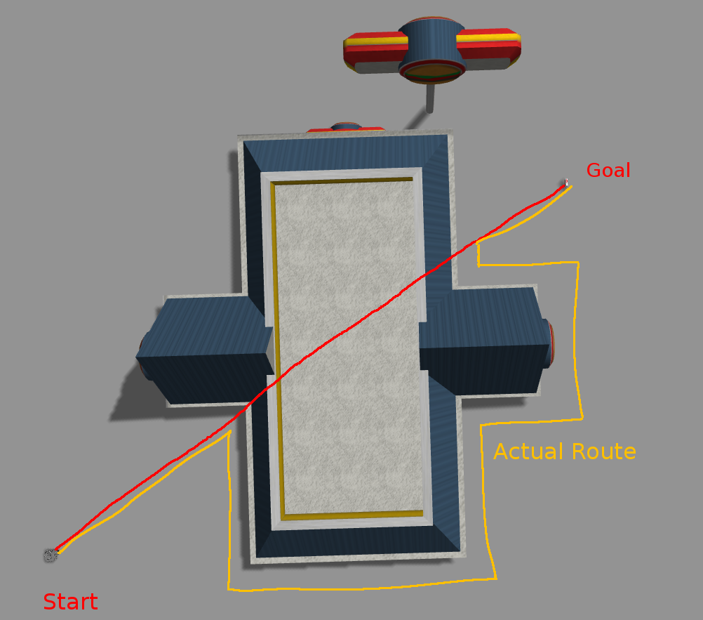
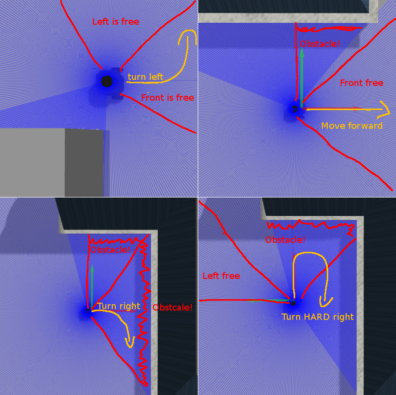

# BotBoost

BotBoost is a TurtleBot Controll Programm. It Takes Published Goals and navigates the Bot to each Goal while Avoiding Ostacles.

## Getting Started
### Installation
Download this repo to your catkin workspace. And source your catkin file.

### Usage
To start the script, run the following snippets in seperate Terminals
```bash
roslaunch turtlebot3_gazebo turtlebot3_empty_world.launch
```
```bash
rosrun gazebo_ros spawn_model -file <path_to_repo>/ts-171727_tier4/final_project_practice/model.sdf -sdf -x 2 -y 1 -model mini_project
```
```bash
roslaunch ts_171727_prj start.launch
```

After that the TurtleBot will automaticly wait for new published Goals and navigate to them.

## General Description
This Programms takes published Goals and navigates the Turtlebot to the given Targets while avoiding Obstacles.
It uses the [Bug v2 from Howie Choset at CMU](https://www.cs.cmu.edu/~motionplanning/lecture/Chap2-Bug-Alg_howie.pdf)

## Algorithm Description

For Every Goal the Following Algorithm (Bug v2) is executed:  
The Algorithm takes a Start and Goal Point. A imagenary line connects both points. The Bot Follows the Line until it encounters a Obstacle. When an Obstacle is encounterd the Bot Follows the Obstacle until its back on the Line Created at the beginning. Then to Bot follows the Line again until the next Obstacle or the Goal is reached.

## Implementation
The Implementation follows the generell Flow of the Algorithm described above.
Here is one Possible Senario in wich the robot manuvers around the obstacle until back on Mainline. (Red)  
  
The Wall Following has been achived with two sensors: left and front. The Bot reacts different depending on what sensors detect an Obstacle:  
  
Threshold for the Sensor Detection Range is 1.2m for the front and 1.5m for the left Sensor.

### Solution to Common Problems
#### Detecting when leaving and joining the Line
One Problem is to detect when the Bot is leaving the Line and when its back on the Line.  
Symptom: The Bot is stuck between 'Obstacle detected/Leaving Line' and 'Back on Line'  
Solution: Save Pos when Obstacle is detected, and only allow 'Back on Line' if a Distance of min. 0,4m has been driven.

#### Bot drifting
The Bot is drifting when movement suddenly is set to more than 0.2m/s forward.  
Symptom: Bot is drifting ~30° to the right while accelerating.  
Solution: Slowly accelerate the Bot until the target speed is reached.  


## Contributing
Pull requests are welcome. For major changes, please open an issue first to discuss what you would like to change.

## License
[The Unlicense](https://choosealicense.com/licenses/unlicense/)
