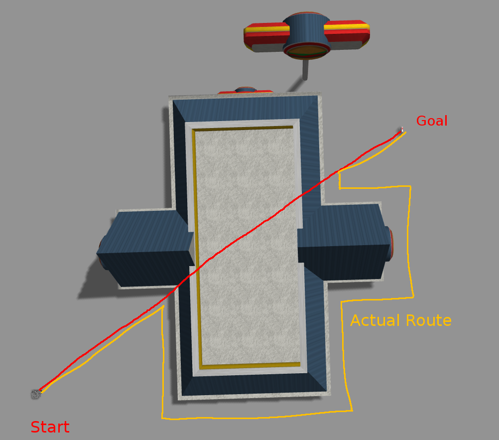
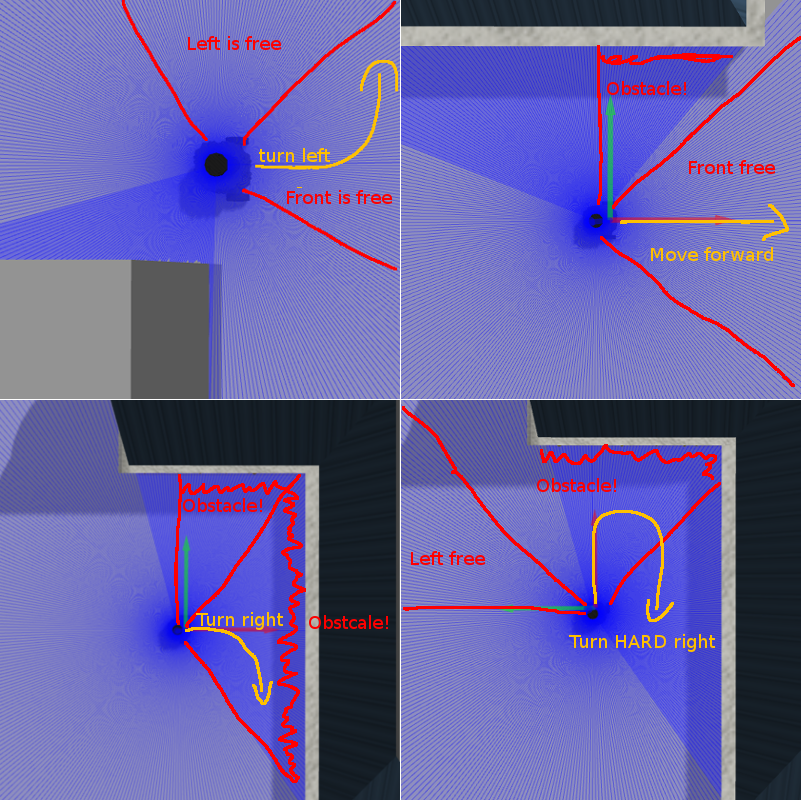
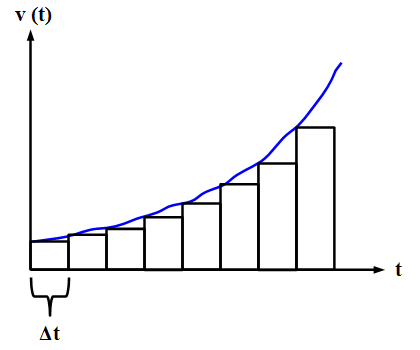

# Turtle Navigator

### Bachelor Final Project 2019

##### Tom Segbers

---

## Agenda

1. Pathfinding
2. Control strategy
3. Notable Problems
4. The Challenge

---

## Pathfinding
- Using Bug Algorithm V2

  

---

## Control strategy
- 2 Sensors (22°@1.2m front, 45°@1.5m left)

  
(not to scale)

---

## Problem: Acceleration
- Problem: Drifting while accelerating.  
- Solution: Constant acceleration towards target speed.   

  

(CC BY-SA 4.0 - Michael Oestreicher   wikibooks - https://bit.ly/2XvuZ8L)

---

# Lets go!

### Lets Start the Bot!
